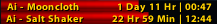

## Profession CD Tracker

A simple addon that shows your profession cooldowns across your characters.

Works with WoW version 3.3.35a.

### Install

1. Download this addon and make sure the folder is named `ProfessionCDTracker`.
2. Put the folder into `World of Warcraft\\Interface\\AddOns\\`.
3. Restart the game.

### Use

- `/pct show` — show the bars
- `/pct hide` — hide the bars
- `/pct unlock` — unlock so you can drag it
- `/pct lock` — lock it in place

Optional:
- `/pct width <number>` — change bar width (e.g. 240)
- `/pct height <number>` — change bar height (e.g. 14)
- `/pct ready [<hours>]` — filter to show only cooldowns ready within threshold (default 10 hours). Use without number to toggle on/off.
- `/pct cdname` — toggle showing cooldown names on bars (e.g. "Char-Moon" vs just "Char")
- `/pct limit [<number>]` — limit the number of bars shown (default 10). Use without number to toggle on/off.

Note:
- Bars may not appear till after first use of cooldowns.